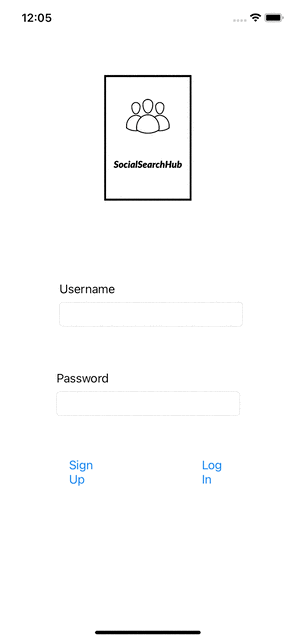
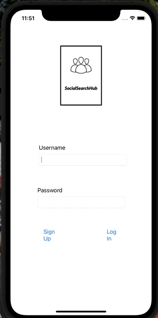
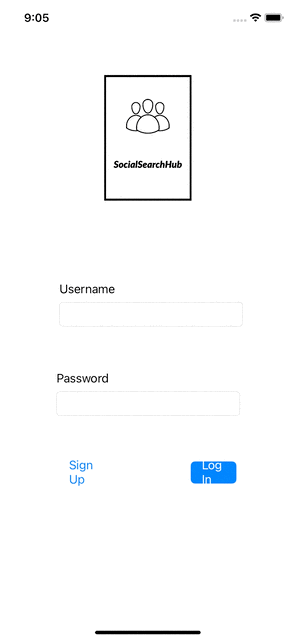

# SocialSearchHub

> 👍 To make edits
> 
> 1. Make sure CocoaPods is installed. See this [guide](https://guides.codepath.org/ios/CocoaPods) if not.
> 2. Clone the workspace.
> 3. Open the terminal
> 4. CD into the directory (that contains the podfile, top-level)
> 5. Run `pod install`. (to install libraries)
>
> Remember to work out of `.xcworkspace` ONLY.

## Table of Contents
1. [Overview](#Overview)
1. [Product Spec](#Product-Spec)
1. [Wireframes](#Wireframes)
2. [Schema](#Schema)

## Overview
### Description
SocialSearchHub is a hub for users to search for topics, ideas, and pictures within multiple social media apps at one time.

### App Evaluation
[Evaluation of your app across the following attributes]
- **Category:** Search Engine
- **Mobile:** Push notifications, real-time
- **Story:** A streamlined view of selected social media for users
- **Market:** Avid social media users
- **Habit:** Everyday -- would be a user's main search engine for social media posts
- **Scope:** Core features is to see sign in and see a feed of their app.

## Product Spec

### 1. User Stories (Required and Optional)

**Required Must-have Stories**
* [x] The user can sign up and create a new account
* [x] The user can log into the app
* [x] The user can log out of the app
* [x] The user can view the selected social media post from within a table view
* [x] The user can add searches to their favorites
* [x] The user can search for specific topics
* [x] The user can toggle Dark / Light mode

**Optional Nice-to-have Stories**
* [x] User can be taken to actual X social media app. (for Instagram)
* [ ] The user can log into their social media apps to save posts for later
* [ ] Enable Push notifiactions 
    

### 2. Screen Archetypes
- Login Screen
    - The user can log into the app
- Sign Up Screen
    - The user can sign up and create a new account
- Home Screen
    - The user can search for specific topics
- Feed Screen
    - The user can view the selected social media post from within a table view
- Profile Screen
    - The user can add searches to their favorites
- Settings Screen
    - The user can log out of the app 
    - The user can toggle Dark / Light mode

### 3. Navigation

**Tab Navigation** (Tab to Screen)
- Home 
- Profile
- Settings

**Flow Navigation** (Screen to Screen)
- Login Screen
    - => Sign up screen
    - => Home screen
- Sign Up Screen
    - => Login Screen
    - => Home Screen
- Home Screen
    - => Profile Screen
    - => Settings Screen
    - => Feed Screen
- Profile Screen
    - => Feed Screen
    - => Settings Screen
    - => Home Screen
- Feed Screen
    - => Home Screen
    - => Settings Screen
    - => Profile Screen

## Wireframes

## Schema 
### Models
#### User
| Property         | Type     | Description |
| ---------------- | -------- | ------------|
| objectId         | String   | unique id for the user post (default field) |
| username         | String   | an identifier for the user |
| password         | String   | the password used to login |
| email            | String   | the email associated with the user |
| favoriteSearches | List     | a collection of strings representing searches favorited by the user |
| darkMode         | Boolean  | if true ui will be in dark mode, if false ui will be in light mode|

### Networking
Signup Screen
- (Create/USER) Create a new user object

Profile Screen
- (Read/GET) Query logged in user object

-Base URL - https://api.twitter.com/1.1
HTTP Verb | Endpoint | Description|
|----------|----------|------------|
|`GET`    | /tweets: | retrieves tweets based on search |
    
-Base URL - graph.facebook.com
HTTP Verb | Endpoint | Description|
|----------|----------|------------|
|`GET`    | /{ig-hashtag-id}/top_media | to get the most popular photos and videos that have a specific hashtag|

## Sprint Gif Demos

### Sprint 1

User Stories Completed:
- The user can sign up and create a new account.
- The user can log into the app.

### Sprint 2

User Stories Completed:
- The user can view the selected social media post from within a table view

### Sprint 3

User Stories Completed:
- The user can add searches to their favorites

